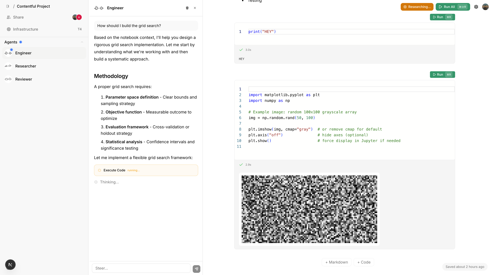
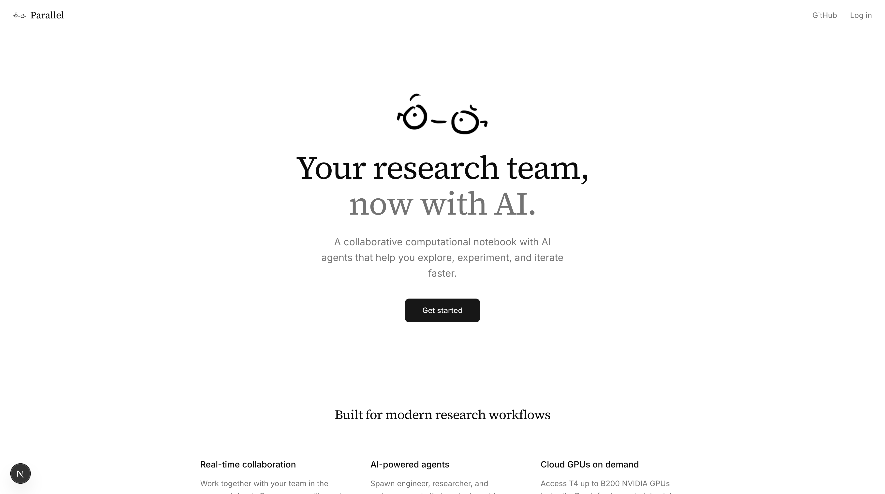

<p align="center">
  <h1 align="center">Parallel</h1>
  <p align="center">Collaborative computational notebooks with AI research agents</p>
</p>

<p align="center">
  <a href="https://humansand.ai">Built at Humans& Product Hackathon</a>
</p>

<br/>

<p align="center">
  
</p>

## The Problem

Research is inherently collaborative, but the tools aren't. Computational notebooks today are single-player experiences — one person writing code, reading papers, and validating results alone. Scaling a research workflow means hiring more people and waiting for them to get up to speed.

## What Parallel Does

Parallel turns your notebook into a multiplayer research environment where AI agents work alongside you as specialized team members. You set a hypothesis, and your team gets to work:

- **Engineer** — designs experiments, writes reproducible code, and executes it in sandboxed environments
- **Researcher** — searches arXiv and the web for relevant literature, surfacing papers and prior work
- **Reviewer** — pokes holes in your methodology, identifies biases, and flags statistical issues

Agents contribute findings directly into your notebook in real-time. You stay in control — review their work, run their code, and iterate together.

<p align="center">
  
</p>

## Features

- **Real-time collaboration** — multiple users editing the same notebook simultaneously via Yjs
- **AI agent roles** — spawn Engineer, Researcher, or Reviewer agents scoped to your workspace
- **Live code execution** — run Python in isolated containers with GPU support (T4 through H200)
- **Research tools** — agents can search arXiv, browse the web, and execute code autonomously
- **Rich output** — inline plots, dataframes, images, and LaTeX math rendering
- **Activity streams** — watch agents think, plan, and contribute in real-time

## Architecture

```
apps/
  web/          → Next.js frontend, Convex backend
  agents/       → Cloudflare Durable Objects for persistent agent state
  sync/         → Yjs WebSocket sync server (Hono + PartyServer)
  sandboxes/    → Python execution containers (FastAPI + Modal for GPU)

packages/
  agent-kit/       → Core agent types and tool implementations
  agent-kit-react/ → React hooks for agent streaming and chat
  ui/              → Shared component library
```

## Tech Stack

| Layer | Tech |
|-------|------|
| Frontend | Next.js 16, React 19, Tailwind CSS, Monaco Editor, Tiptap |
| Backend | Convex (DB + auth + functions) |
| Agents | Cloudflare Durable Objects, AI SDK, Claude Sonnet 4.6 |
| Sync | Yjs, PartyServer, Upstash Redis |
| Execution | FastAPI, Modal (GPU sandboxes), Docker |
| Monorepo | Turborepo, Bun |

## Getting Started

```bash
# Install dependencies
bun install

# Run all services in dev mode
turbo dev
```

Individual services:

```bash
turbo dev --filter=web        # Next.js app (port 3000)
turbo dev --filter=agents     # Agent server
turbo dev --filter=sync       # Sync server (port 8383)
```

Built solo in 8 hours at the [Humans& Product Hackathon](https://humansand.ai).

<p align="center">
  
</p>